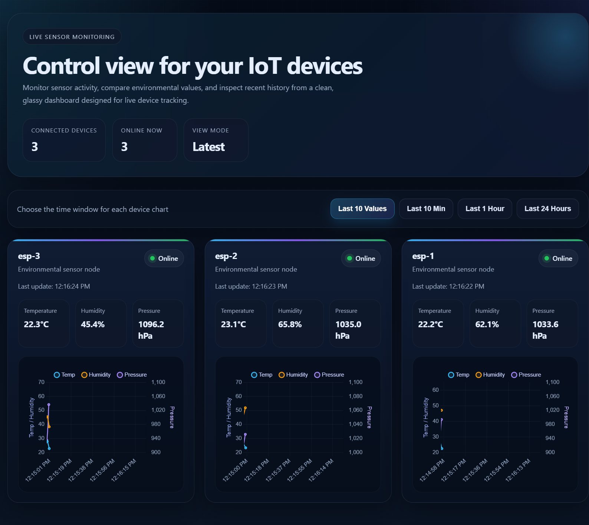

# 🌐 IoT Dashboard using ESP8266 + Node.js + MongoDB

A real-time IoT monitoring system where **ESP8266 devices send sensor data to a cloud server**, which is stored in MongoDB and visualized on a web dashboard using charts.

---

## 🚀 Features

* 📡 ESP8266 sends data via **HTTPS (JSON)**
* 🌍 Node.js backend (Express) handles API & database
* 🗄 MongoDB stores historical sensor data
* 📊 Interactive dashboard with **Chart.js**
* ⏱ Multiple time filters:

  * Last 10 values (real-time)
  * Last 10 minutes
  * Last 1 hour
  * Last 24 hours
* ⚡ Real-time updates for latest data
* 📈 Dual-axis charts for better visualization

---

## 🏗 Architecture

```
ESP8266 → HTTPS → Node.js Server → MongoDB → Frontend Dashboard
```

---

## 📁 Project Structure

```
├── public/
│   └── index.html        # Frontend dashboard
│
├── routes/
│   ├── data.js           # /update and /current APIs
│   └── history.js        # /history/:device API
│
├── models/
│   └── Sensor.js         # MongoDB schema
│
├── server.js             # Main server entry
├── .env                  # Environment variables
├── package.json
└── README.md
```

---

## ⚙️ Backend Setup

### 1. Clone repo

```
git clone https://github.com/your-username/iot-dashboard.git
cd iot-dashboard
```

### 2. Install dependencies

```
npm install
```

### 3. Create `.env`

```
MONGO_URI=your_mongodb_connection_string
```

### 4. Run server

```
node server.js
```

Server will run at:

```
http://localhost:3000
```

---

## 🌍 Deployment (Render)

* Deploy Node.js backend on **Render**
* Set environment variable:

  * `MONGO_URI`
* Use HTTPS endpoint:

```
https://your-app.onrender.com/update
```
* Website Screenshot:
<p align="center">
  
</p>
* Website Link: Even though website currently would show offline. <a href="https://iot-dashboard-4sos.onrender.com/" target="_blank">Open Website</a>
---

## 📡 ESP8266 Code (HTTPS)

```cpp
WiFiClientSecure client;
client.setInsecure();

HTTPClient http;

http.begin(client, "https://your-app.onrender.com/update");
http.addHeader("Content-Type", "application/json");

String payload = "{\"device\":\"esp-1\",\"temperature\":25.5,\"humidity\":60,\"pressure\":1000}";

int code = http.POST(payload);
```

---

## 🔌 API Endpoints

### 📤 POST `/update`

Send sensor data

```json
{
  "device": "esp-1",
  "temperature": 25.5,
  "humidity": 60,
  "pressure": 1000
}
```

---

### 📥 GET `/current`

Get latest data of all devices

---

### 📊 GET `/history/:device?range=`

Get historical data

| Range      | Description     |
| ---------- | --------------- |
| `10latest` | Last 10 values  |
| `10min`    | Last 10 minutes |
| `1h`       | Last 1 hour     |
| `24h`      | Last 24 hours   |

---

## 📊 Frontend

* Built using **HTML + Chart.js**
* Real-time updates every few seconds
* Buttons to switch time ranges
* Dual-axis charts:

  * Temperature & Humidity (left axis)
  * Pressure (right axis)

---

## ⚠️ Notes

* Render supports **HTTPS only**
* ESP8266 must use:

```
WiFiClientSecure + setInsecure()
```

* Do NOT use HTTP → causes 307 redirect errors

---

## 🔮 Future Improvements

* 📦 Batch data sending
* 🔁 Retry mechanism on failure
* 📡 WebSocket for real-time streaming
* 📱 Mobile-friendly UI
* 🔋 Low-power ESP optimization

---

## 👨‍💻 Author

**Sushant Saroch**

---

## ⭐ If you like this project

Give it a ⭐ on GitHub!
